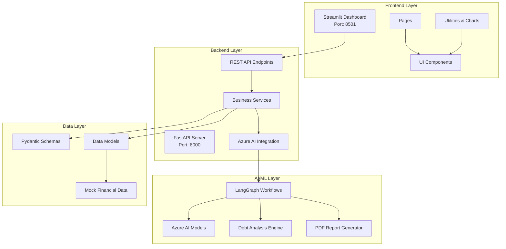
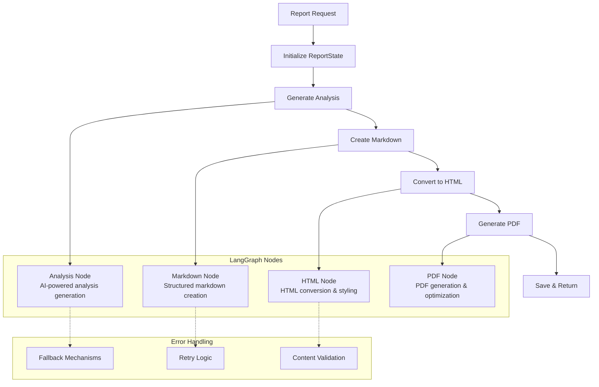
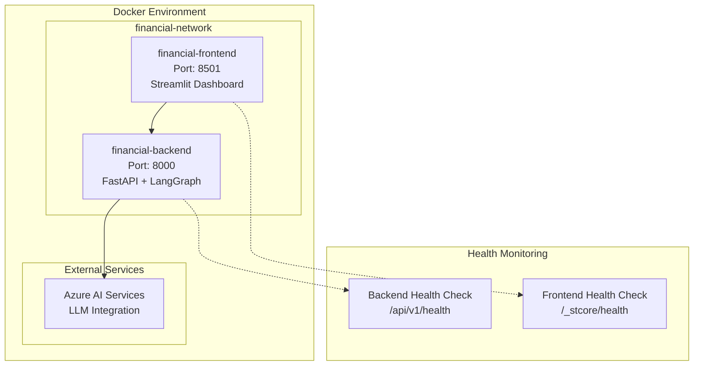

# Financial Restructuring Assistant - Full Stack Application

This repository contains a complete financial restructuring assistant with AI-powered debt analysis capabilities, built with modern Python technologies and LangGraph workflows.

## 🏗️ Architecture



### Backend (FastAPI)
- **Location**: `./backend/`
- **Technology**: FastAPI with Python 3.10+, LangGraph workflows
- **Features**: RESTful API, AI-powered analysis, LangGraph PDF generation, comprehensive financial services
- **Port**: 8000
- **Key Technologies**: FastAPI, LangGraph, LangChain, Azure AI, Pydantic, WeasyPrint

### Frontend (Streamlit)
- **Location**: `./frontend/`
- **Technology**: Streamlit with Python 3.10+
- **Features**: Interactive dashboard, data visualization, real-time analysis, report management
- **Port**: 8501
- **Key Technologies**: Streamlit, Plotly, Pandas, Navigation Bar

## 🚀 Quick Start

### Using Docker Compose (Recommended)

```bash
# Clone the repository
git clone <repository-url>
cd desafio_tecnico_ia_developer

# Start the full stack with health monitoring
docker-compose up --build
```

This will start:
- **Backend API**: http://localhost:8000
- **Frontend Dashboard**: http://localhost:8501
- **API Documentation**: http://localhost:8000/docs

### Manual Setup

#### Prerequisites
- Python 3.10+
- UV package manager (recommended) or pip
- Azure AI credentials (for LLM features)

#### Backend Setup
```bash
cd backend

# Using UV (recommended for fast dependency resolution)
uv pip install --system -e .

# Or using pip
pip install -e .

# Setup environment variables
cp .env.example .env
# Edit .env with your Azure AI credentials

# Run the backend
python main.py
```

#### Frontend Setup
```bash
cd frontend

# Using UV (recommended)
uv pip install --system -e .

# Or using pip
pip install -e .

# Setup environment variables
cp .env.example .env

# Run the frontend
streamlit run app.py
```

## 📁 Project Structure

```
desafio_tecnico_ia_developer/
├── backend/                          # FastAPI Backend with AI Integration
│   ├── app/
│   │   ├── api/v1/                  # API endpoints (RESTful)
│   │   │   ├── router.py           # Main API router
│   │   │   └── endpoints/          # Individual endpoint modules
│   │   │       ├── analysis.py    # Debt analysis endpoints
│   │   │       ├── cards.py       # Credit card management
│   │   │       ├── cashflows.py   # Cash flow analysis
│   │   │       ├── credit_scores.py # Credit scoring
│   │   │       ├── customers.py   # Customer management
│   │   │       ├── health.py      # Health checks
│   │   │       ├── loans.py       # Loan management
│   │   │       ├── payments.py    # Payment tracking
│   │   │       └── pdf_reports.py # Report generation
│   │   ├── core/                    # Core configuration & utilities
│   │   │   ├── config.py           # Application settings
│   │   │   ├── errors.py           # Error handling
│   │   │   ├── llm_utils.py        # LLM integration utilities
│   │   │   ├── html_utils.py       # HTML processing
│   │   │   ├── pdf_utils.py        # PDF generation utilities
│   │   │   ├── report_styles.py    # Report styling
│   │   │   └── report_utils.py     # Report processing
│   │   ├── db/                      # Database layer
│   │   │   └── database.py         # Database configuration
│   │   ├── models/                  # Data models
│   │   ├── schemas/                 # Pydantic schemas
│   │   │   ├── analysis.py         # Analysis data structures
│   │   │   ├── base.py             # Base schemas
│   │   │   ├── card.py             # Credit card schemas
│   │   │   ├── cashflow.py         # Cash flow schemas
│   │   │   ├── credit_score.py     # Credit scoring schemas
│   │   │   ├── customer.py         # Customer schemas
│   │   │   ├── loan.py             # Loan schemas
│   │   │   ├── payment.py          # Payment schemas
│   │   │   └── pdf_report.py       # Report schemas
│   │   └── services/                # Business logic services
│   │       ├── analysis_service.py # Debt analysis logic
│   │       ├── azure_ai_service.py # Azure AI integration
│   │       ├── card_service.py     # Card management
│   │       ├── cashflow_service.py # Cash flow analysis
│   │       ├── credit_score_service.py # Credit scoring
│   │       ├── customer_service.py # Customer management
│   │       ├── loan_service.py     # Loan management
│   │       ├── payment_service.py  # Payment processing
│   │       ├── pdf_report_service.py # LangGraph PDF generation
│   │       └── service_factory.py  # Service dependency injection
│   ├── tests/                       # Test suite
│   ├── Dockerfile                   # Backend container
│   ├── pyproject.toml              # UV dependencies & project config
│   ├── uv.lock                     # Dependency lock file
│   └── main.py                     # Application entry point
├── frontend/                        # Streamlit Frontend
│   ├── src/
│   │   ├── config/                 # Configuration management
│   │   │   └── settings.py         # Frontend settings
│   │   ├── utils/                  # Utilities & helpers
│   │   │   ├── api_client.py       # Backend API client
│   │   │   ├── charts.py           # Chart generation
│   │   │   └── ui_helpers.py       # UI utility functions
│   │   ├── components/             # Reusable UI components
│   │   │   └── ui_components.py    # Component library
│   │   └── pages/                  # Application pages
│   │       ├── consolidation_analysis.py # Offer analysis
│   │       ├── customer_dashboard.py     # Customer overview
│   │       ├── data_management.py        # Data browser
│   │       ├── debt_analysis.py          # Debt analysis page
│   │       ├── payment_simulations.py    # Payment scenarios
│   │       └── pdf_reports.py            # Report generation
│   ├── assets/                     # Static assets
│   ├── Dockerfile                  # Frontend container
│   ├── pyproject.toml             # UV dependencies & project config
│   ├── uv.lock                    # Dependency lock file
│   └── app.py                     # Main Streamlit application
├── docker-compose.yml              # Full stack orchestration
├── FRONTEND_REQUIREMENTS.md        # API documentation
└── README.md                       # This file
```

## 🔧 Features

### Backend Capabilities

#### 🏦 Financial Services
- **Customer Management**: Complete financial profiles with credit history
- **Loan Portfolio**: Comprehensive loan tracking and analysis
- **Credit Card Management**: Multi-card portfolio analysis
- **Payment Processing**: Historical payment tracking and analysis
- **Cash Flow Analysis**: Detailed cash flow projections and insights
- **Credit Scoring**: Historical credit score tracking and analysis

#### 🤖 AI-Powered Analysis
- **Debt Analysis Engine**: AI-driven debt restructuring recommendations
- **Azure AI Integration**: Leverages Azure's powerful language models
- **LangGraph Workflows**: Structured AI processing pipelines for report generation
- **Payment Optimization**: Minimum vs optimized payment strategies
- **Consolidation Analysis**: Intelligent offer evaluation and recommendations

#### 📊 Report Generation
- **LangGraph PDF Engine**: Advanced workflow-based PDF generation
- **Multi-stage Processing**: Analysis → Markdown → HTML → PDF pipeline
- **Professional Styling**: Corporate-grade report formatting
- **Comprehensive Reports**: Detailed financial analysis with recommendations
- **Error Handling**: Robust fallback mechanisms for report generation

### Frontend Features

#### 📱 Interactive Dashboard
- **Customer Dashboard**: Real-time financial health overview
- **Multi-page Navigation**: Streamlined user experience
- **Responsive Design**: Modern, professional interface
- **Data Visualization**: Interactive charts and graphs using Plotly

#### 🔍 Analysis Tools
- **Debt Analysis Page**: Configure and run comprehensive debt analysis
- **Payment Simulations**: Compare different payment scenarios
- **Consolidation Analysis**: Evaluate consolidation offers with AI insights
- **Real-time Processing**: Live updates and interactive analysis

#### 📋 Data Management
- **Portfolio Browser**: Explore customer financial portfolios
- **Historical Data**: Track credit scores and financial metrics over time
- **Export Capabilities**: Generate and download professional reports
- **API Integration**: Seamless backend communication with error handling

## 🌐 API Endpoints

```mermaid
graph LR
    subgraph "Health & System"
        A[GET /api/v1/health]
    end
    
    subgraph "Customer Management"
        B[GET /api/v1/customers]
        C[GET /api/v1/customers/{id}/profile]
        D[GET /api/v1/customers/{id}/summary]
    end
    
    subgraph "Financial Data"
        E[GET /api/v1/loans/{customer_id}]
        F[GET /api/v1/cards/{customer_id}]
        G[GET /api/v1/payments/{customer_id}]
        H[GET /api/v1/cashflows/{customer_id}]
        I[GET /api/v1/credit-scores/{customer_id}]
    end
    
    subgraph "AI Analysis"
        J[POST /api/v1/analysis/debt-analysis]
        K[POST /api/v1/analysis/payment-simulation]
    end
    
    subgraph "Report Generation"
        L[POST /api/v1/reports/generate-report]
        M[GET /api/v1/reports/{report_id}]
    end
```

### Core Endpoints

#### System Health
- `GET /api/v1/health` - System health check and status

#### Customer Management
- `GET /api/v1/customers` - List all customers
- `GET /api/v1/customers/{id}/profile` - Detailed customer profile
- `GET /api/v1/customers/{id}/summary` - Customer financial summary

#### Financial Data Access
- `GET /api/v1/loans/{customer_id}` - Customer loan portfolio
- `GET /api/v1/cards/{customer_id}` - Credit card information
- `GET /api/v1/payments/{customer_id}` - Payment history
- `GET /api/v1/cashflows/{customer_id}` - Cash flow data
- `GET /api/v1/credit-scores/{customer_id}` - Credit score history

#### AI-Powered Analysis
- `POST /api/v1/analysis/debt-analysis` - Comprehensive debt analysis with AI recommendations
- `POST /api/v1/analysis/payment-simulation` - Payment strategy simulations

#### Report Generation (LangGraph-powered)
- `POST /api/v1/reports/generate-report` - Generate PDF financial reports
- `GET /api/v1/reports/{report_id}` - Retrieve generated reports

### Complete API Documentation
See [FRONTEND_REQUIREMENTS.md](./FRONTEND_REQUIREMENTS.md) for detailed API documentation with curl examples and request/response schemas.

## 🤖 AI & LangGraph Integration

### LangGraph Workflow Architecture



### AI Technologies

#### Azure AI Integration
- **Model**: Azure AI language models for financial analysis
- **Temperature Control**: Configurable creativity vs consistency
- **Prompt Engineering**: Specialized prompts for financial domain
- **Error Handling**: Robust fallback mechanisms

#### LangGraph Features
- **State Management**: Persistent state across workflow steps
- **Node-based Processing**: Modular, testable workflow components
- **Error Recovery**: Automatic fallbacks and retry mechanisms
- **Pipeline Optimization**: Efficient multi-stage processing

### Workflow Components

#### 1. Analysis Generation
- Financial data interpretation
- AI-powered insights generation
- Risk assessment and recommendations
- Payment strategy optimization

#### 2. Content Formatting
- Structured markdown generation
- Professional report formatting
- Data visualization preparation
- Consistency validation

#### 3. Document Processing
- HTML conversion with styling
- CSS injection for professional appearance
- Cross-platform compatibility
- Quality assurance checks

#### 4. PDF Generation
- High-quality PDF rendering
- Corporate-style formatting
- Multi-page support
- Embedded graphics and tables

## 🐳 Docker Configuration

### Services Architecture



### Service Configuration

#### Backend Service (financial-backend)
- **Base Image**: Python 3.10+ with UV package manager
- **Health Checks**: API endpoint monitoring
- **Environment**: Configurable via .env file
- **Networks**: Isolated bridge network
- **Dependencies**: FastAPI, LangGraph, Azure AI, WeasyPrint

#### Frontend Service (financial-frontend)
- **Base Image**: Python 3.10+ with Streamlit
- **Health Checks**: Streamlit server health monitoring
- **Environment**: API endpoint configuration
- **Networks**: Same bridge network for backend communication
- **Dependencies**: Streamlit, Plotly, Navigation Bar

### Health Monitoring
Both services include comprehensive health monitoring:
- **Backend**: API endpoint health verification with timeout handling
- **Frontend**: Streamlit server health checks with automatic restart
- **Network**: Isolated communication with service discovery
- **Dependency Management**: Frontend waits for backend readiness

## 📊 Usage Examples

### Customer Analysis
1. Access the frontend at http://localhost:8501
2. Select a customer from the sidebar
3. Navigate to "Debt Analysis" page
4. Configure consolidation offers
5. Run comprehensive analysis
6. View results and recommendations

### Report Generation
1. Go to "PDF Reports" page
2. Configure report parameters
3. Select consolidation offers
4. Generate PDF report
5. Download or preview results

## 🔍 Monitoring & Health

### Health Checks
- Backend: `curl http://localhost:8000/api/v1/health`
- Frontend: `curl http://localhost:8501/_stcore/health`

### Logs
```bash
# View backend logs
docker-compose logs backend

# View frontend logs  
docker-compose logs frontend

# Follow all logs
docker-compose logs -f
```

## ⚙️ Configuration

### Environment Setup

#### Backend Configuration (`backend/.env`)
```bash
# Server Configuration
HOST=0.0.0.0
PORT=8000
DEBUG=true

# Application Settings
PROJECT_NAME="Financial Restructuring Assistant"
PROJECT_DESCRIPTION="AI-powered financial analysis platform"
VERSION="1.0.0"
API_V1_STR="/api/v1"

# Azure AI Configuration (Required for AI features)
AZURE_INFERENCE_ENDPOINT=https://your-endpoint.inference.ai.azure.com
AZURE_INFERENCE_CREDENTIAL=your_api_key_here
AZURE_INFERENCE_MODEL=gpt-4

# CORS Configuration
ALLOWED_ORIGINS=["http://localhost:8501"]
```

#### Frontend Configuration (`frontend/.env`)
```bash
# API Configuration
API_BASE_URL=http://localhost:8000
API_TIMEOUT=30

# Streamlit Configuration
STREAMLIT_SERVER_PORT=8501
STREAMLIT_SERVER_ADDRESS=0.0.0.0
STREAMLIT_SERVER_HEADLESS=true

# UI Configuration
DEBUG=false
```

### Configuration Management

The application uses environment-based configuration with fallback defaults. Key settings can be modified in:
- **Backend**: `backend/app/core/config.py`
- **Frontend**: `frontend/src/config/settings.py`

### Docker Environment
- **Network Isolation**: Services communicate through `financial-network`
- **Health Monitoring**: Automated health checks for both services
- **Environment Variables**: Centralized configuration via .env files
- **Port Mapping**: Configurable port exposure for flexibility